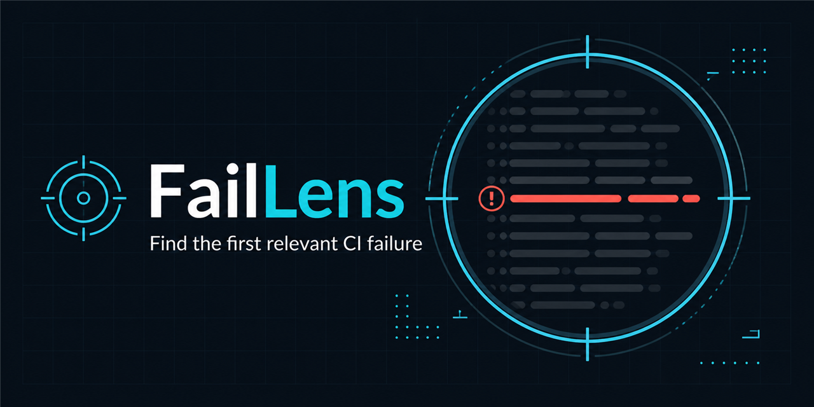
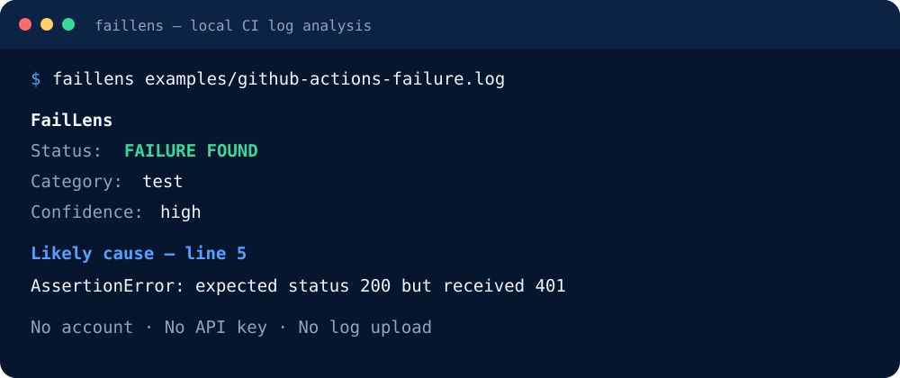

# FailLens

[](https://www.npmjs.com/package/@soaressilves/faillens)
[](https://github.com/marketplace/actions/faillens-ci-log-analysis)
[](https://github.com/soaressilves/faillens/actions/workflows/ci.yml)
[](./LICENSE)

Find the first relevant failure in noisy CI logs — locally, deterministically, and without uploading your data.

> Project status: early MVP (`0.2.0`).



## Why FailLens?

CI logs often contain thousands of status lines, warnings, downloads, stack frames, and a final generic `exit code 1`. FailLens removes common noise, ranks actionable signals, and points to the most specific failure it can identify.

- No account or API key.
- No network requests or log uploads.
- Zero runtime dependencies.
- Text, Markdown, and stable JSON output.
- Works as a CLI and as an importable Node.js module.
- Runs as a GitHub Action and writes a compact job summary.
- Includes an Agent Skill for coding agents.

The regression corpus currently covers representative logs from Jest, Pytest, TypeScript, Maven/Java, Rust, Go, .NET, Docker, npm dependency resolution, Node.js memory failures, ESLint, and GitHub Actions wrapper errors.

## Install

Requirements: Node.js 20 or newer.

```bash
npm install --global @soaressilves/faillens
faillens --version
faillens path/to/build.log
```

## Try it from source

```bash
git clone https://github.com/soaressilves/faillens.git
cd faillens
npm test
node ./bin/faillens.js ./examples/github-actions-failure.log
```



Expected result:

```text
FailLens
Status: FAILURE FOUND
Category: test
Confidence: high

Likely cause — line 5
AssertionError: expected status 200 but received 401
```

Analyze a command through stdin:

```bash
npm test 2>&1 | node ./bin/faillens.js -
```

Generate Markdown for a Pull Request comment:

```bash
node ./bin/faillens.js build.log --format markdown --output faillens-report.md
```

Generate machine-readable JSON:

```bash
node ./bin/faillens.js build.log --format json
```

Return exit code `1` when a failure is detected:

```bash
node ./bin/faillens.js build.log --fail-on-detection
```

Run `node ./bin/faillens.js --help` for every option.

## GitHub Action

Capture a command's output in a log file, then analyze it even when the command fails:

```yaml
- name: Run tests and capture the log
  id: tests
  shell: bash
  run: npm test > test-output.log 2>&1

- name: Analyze the test log
  id: faillens
  if: failure() && steps.tests.outcome == 'failure'
  uses: soaressilves/faillens@v0.2.0
  with:
    log-file: test-output.log
    context: "2"
```

The original test failure still determines the job result. The Action writes its report to the GitHub job summary and exposes `status`, `category`, `confidence`, `fingerprint`, and `line` outputs. Set `fail-on-detection` to `true` when analyzing a log produced by a step that did not already fail the job.

See the [GitHub Action guide](./docs/GITHUB-ACTION.md) for complete inputs, outputs, and workflow patterns.

Validate the same artifact published to npm:

```bash
npm run verify:package
```

This command packs the project, installs it in a clean temporary directory, confirms the generated executable, runs the installed CLI, and removes the temporary files.

## How the MVP works

1. Remove ANSI color sequences, timestamps, and CI annotations.
2. Ignore known low-value lines such as cache and download messages.
3. Detect test, compiler, dependency, runtime, command, and generic errors.
4. Prefer specific signals over wrapper messages such as `exit code 1`.
5. Return the relevant line, nearby context, confidence, and a stable fingerprint.

FailLens uses deterministic rules; it does not call an LLM. See the [quick start](./docs/QUICKSTART.md), [architecture](./docs/ARCHITECTURE.md), and [MVP scope](./docs/MVP-0.1.0.md).

## Use from JavaScript

```js
import { analyzeLog } from "@soaressilves/faillens";

const result = analyzeLog(logText, { context: 3 });
console.log(result.primary);
```

## Agent Skill

The reusable skill lives at [`skills/faillens/SKILL.md`](./skills/faillens/SKILL.md). It tells compatible coding agents how to run FailLens, preserve privacy, interpret the report, and verify a suspected root cause.

## Limitations

- The current rules focus on common English CI messages.
- A detected line is a lead, not proof of the root cause.
- Multi-job log correlation and flaky-test history are not part of the local MVP.
- Logs can contain secrets; review them before sharing reports publicly.

## Contributing and security

Read [CONTRIBUTING.md](./CONTRIBUTING.md) before opening a Pull Request. Report security problems privately according to [SECURITY.md](./SECURITY.md).

## License

[MIT](./LICENSE) © 2026 Paulo Soares Silves.
